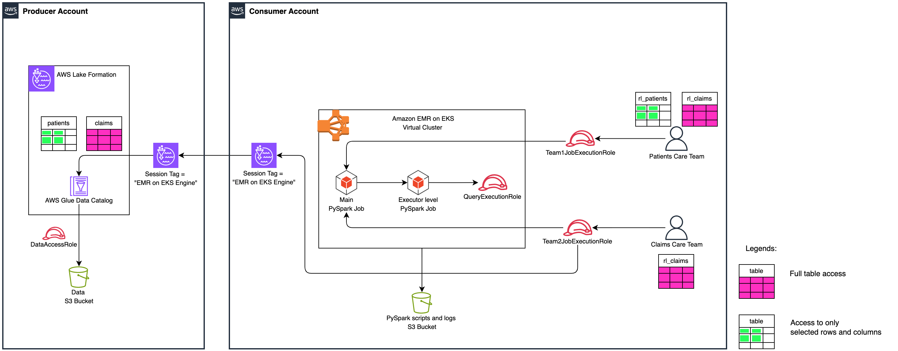

## Amazon EMR on Amazon Elastic Kubernetes Service (EKS) FGAC for Apache Iceberg with AWS Lake Formation

This repository holds sample code to deploy resources for blog EMR on EKS FGAC with Apache Iceberg tables.

## Amazon EMR on EKS FGAC Blog Solution Architecture



## Prerequisite

- [eksctl](https://docs.aws.amazon.com/emr/latest/EMR-on-EKS-DevelopmentGuide/setting-up-eksctl.html)  are installed.
- [AWS CLI](https://docs.aws.amazon.com/emr/latest/EMR-on-EKS-DevelopmentGuide/setting-up-cli.html) is installed or upgraded.
- For a quick start, you can use [AWS CloudShell](https://console.aws.amazon.com/cloudshell) which has included AWS CLI and kubectl.

## Clone the project

Download the sample project either to your computer or to your AWS CloudShell Console.
```
git clone https://github.com/aws-samples/sample-emr-on-eks-fgac-iceberg.git
cd sample-emr-on-eks-fgac-iceberg 
```

### Setup Producer AWS Account

Set following environment variables:

```
export AWS_REGION=<AWS_REGION>
export PRODUCER_AWS_ACCOUNT=<YOUR_PRODUCER_AWS_ACCOUNT_ID>
export CONSUMER_AWS_ACCOUNT=<YOUR_CONSUMER_AWS_ACCOUNT_ID>
export ENVIRONMENT=<YOUR_ENVIRONMENT>
```

Run following command:

```
producer_account_setup/producer_iceberg_datalake_setup.sh > producer_account_setup/logs/producer_setup_logs.txt 2>&1
```

### Setup Consumer AWS Account

Set following environment variables:

```
export AWS_REGION=<AWS_REGION>
export PRODUCER_AWS_ACCOUNT=<YOUR_PRODUCER_AWS_ACCOUNT_ID>
export CONSUMER_AWS_ACCOUNT=<YOUR_CONSUMER_AWS_ACCOUNT_ID>
export ENVIRONMENT=<YOUR_ENVIRONMENT>
```
Run following command:

```
consumer_account_setup/consumer_emr_on_eks_setup.sh > consumer_account_setup/logs/consumer_setup_logs.txt 2>&1
```

### Cleanup Consumer AWS Account

Set following environment variables:
```
export AWS_REGION=<AWS_REGION>
export PRODUCER_AWS_ACCOUNT=<YOUR_PRODUCER_AWS_ACCOUNT_ID>
export CONSUMER_AWS_ACCOUNT=<YOUR_CONSUMER_AWS_ACCOUNT_ID>
export ENVIRONMENT=<YOUR_ENVIRONMENT>
```
Run following command:
```
consumer_account_setup/consumer_clean_up.sh > consumer_account_setup/logs/consumer_cleanup_logs.txt 2>&1
```

### Cleanup Producer AWS Account

Set following environment variables:
```
export AWS_REGION=<AWS_REGION>
export PRODUCER_AWS_ACCOUNT=<YOUR_PRODUCER_AWS_ACCOUNT_ID>
export CONSUMER_AWS_ACCOUNT=<YOUR_CONSUMER_AWS_ACCOUNT_ID>
export ENVIRONMENT=<YOUR_ENVIRONMENT>
```
Run following command:
```
producer_account_setup/producer_clean_up.sh > producer_account_setup/logs/producer_cleanup_logs.txt 2>&1

```

### Logs

You can validate logs for each shell script runs in logs directory.

## Security

See [CONTRIBUTING](CONTRIBUTING.md#security-issue-notifications) for more information.

## License

This library is licensed under the MIT-0 License. See the LICENSE file.

## Authors

1. Tejal Patel (Sr. Delivery Consultant - AWS Professional Services)
2. Janakiraman Shanmugam (Sr. Delivery Consultant - AWS Professional Services)